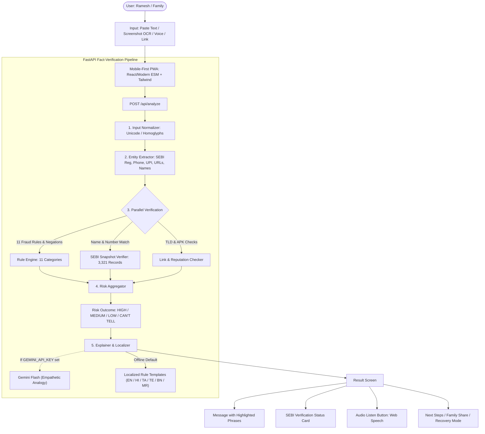

# TRACE — Scam & Claim Verifier
### Investor Safety Infrastructure
**SANGYAN Investor Resilience Hackathon • Track A (Digital Fraud & Scam Resilience) + Track E Elements**

[]()
[]()
[]()
[]()

---

## 1. Product Identity & Purpose

**Trace** is a modern, minimal, trustworthy investor-protection application (PWA) built to protect first-time investors, senior citizens, and families in Tier-2/3 cities across India.

### What Trace Is:
* **Investor Safety Infrastructure**: Helps users verify suspicious investment messages, screenshots, voice notes, and links **before** money moves or an unknown APK is installed.
* **Deterministic Fact-Verification Engine**: Code rigorously verifies facts against an authentic dated snapshot of **3,321 official SEBI registered entities** (as of October 03, 2026) and 11 fraud rule categories with negation handling.
* **Empathetic Regional Translation**: Localized explanations, summaries, and audio readout in **English, Hindi (हिन्दी), Tamil (தமிழ்), Telugu (తెలుగు), Bengali (বাংলা), and Marathi (मराठी)**.

### What Trace Is NOT:
* NOT a trading app or investment platform.
* NOT a stock-picking or financial advisory tool.
* NOT a fintech monetization product.
* Stores **NO** user messages, images, SMS, or OTPs.

---

## 2. Primary Demo Persona

* **Persona**: Ramesh, 62, retired school teacher residing in a Tier-2 city (Solapur/Nagpur/Nashik).
* **Language Comfort**: Marathi and Hindi.
* **Scenario**: Receives an urgent WhatsApp message claiming to be from a *"SEBI-registered analyst"* promising a *"guaranteed 40% monthly return"* with a link to *"download a private APK app not on Play Store"*.
* **Trace's Response**:
  1. Instant **High Risk** verdict with icon, color, and plain-language Marathi explanation.
  2. Audio readout reads the warning aloud in Marathi.
  3. Visual highlights on the exact suspicious phrases.
  4. Cross-checks claimed SEBI registration against official records.
  5. One-tap **Family Guardian Share** to inform his children.
  6. **"I Already Paid" (Recovery Mode)** with immediate 1930 helpline guidance and pre-filled cybercrime complaint drafting.

---

## 3. Four Conceptual Risk Outcomes

In strict adherence to the project rules, Trace never forces messages into binary "Scam" or "Safe" absolutes. It assesses risk honestly across 4 bands:

| Risk Outcome | Visual Representation | Meaning | Example |
| :--- | :--- | :--- | :--- |
| **HIGH RISK** | 🔴 Shield Alert (Red) | Multiple severe warning signs found | Guaranteed returns, APK downloads, personal UPI requests |
| **MEDIUM RISK** | 🟡 Warning Triangle (Amber) | Elements require caution before acting | VIP Telegram groups, unverified urgency |
| **LOW RISK** | 🟢 Shield Check (Green) | Standard official notice or verified SEBI entity | Authentic advisor disclosures, SIP debit notices |
| **CAN'T TELL** | ⚪ Help Circle (Slate/Amber) | Insufficient evidence to establish risk | Casual personal chat, ambiguous query |

---

## 4. Architecture & Pipeline



---

## 5. Detection Rule Engine (11 Categories from `Fraud.docx`)

1. **`guaranteed_returns`**: Guaranteed, assured, or risk-free return promises.
2. **`unrealistic_returns`**: Unrealistic profit percentages (e.g. 40% monthly, doubling in 45 days).
3. **`fake_sebi_claim`**: Misuse of SEBI approval or registration to manufacture false credibility.
4. **`urgency_pressure`**: Artificial urgency (e.g. "15 minutes left", "only 10 slots remaining").
5. **`private_group`**: Exclusive Telegram or VIP WhatsApp group invitations.
6. **`insider_tip`**: Claims of insider calls or privileged market knowledge.
7. **`app_install`**: Pressure to install unknown APKs or apps outside Google Play Store.
8. **`remote_access`**: Requests for screen-sharing or remote device access (AnyDesk, TeamViewer).
9. **`personal_upi`**: Direct transfer requests to personal UPI accounts.
10. **`bank_transfer`**: Requests for private bank transfers bypassing official gateways.
11. **`withdrawal_fee`**: Demanding advance "fees" or "taxes" before releasing profits.

### Negation Handling Example:
* *"Get guaranteed 40% returns"* $\rightarrow$ **FLAGGED** (`guaranteed_returns`, `unrealistic_returns`).
* *"Mutual funds are subject to market risks, returns are NOT guaranteed"* $\rightarrow$ **NOT FLAGGED** (Negation detected).

---

## 6. Official SEBI Registry Snapshot

* **Snapshot Date**: October 03, 2026
* **Parsed Records**:
  * 1,050 Registered Investment Advisers (IA)
  * 2,271 Registered Research Analysts (RA)
  * Total: **3,321 Official SEBI Entities**
* **Impersonation Attack Detection**:
  * If a scammer quotes a real registration number (e.g., `INH000000016`) but gives a false sender name (e.g., *"Rajesh Sharma"*), Trace detects the discrepancy and flags:
    `FOUND_NAME_MISMATCH: Impersonation Alert! Registration belongs to STAKEHOLDERS EMPOWERMENT SERVICES, not the claimed sender.`

---

## 7. Benchmark Evaluation (100 Test Cases)

Trace includes an automated evaluation benchmark tested across all 50 synthetic scam messages from `Fraud.docx`, plus 25 genuine messages and 25 ambiguous messages:

```text
======================================================================
BENCHMARK EVALUATION RESULTS
======================================================================
Total Test Cases:            100
Scam Detection Rate:         100.0% (50/50)
Genuine Messages Correct:    100.0% (25/25)
False Positive Alarm Rate:   0.0%
Ambiguous / Can't Tell Rate: 100.0% (25/25)
Overall Benchmark Accuracy:  100.0%
======================================================================
```

---

## 8. Quick Start & Execution

### Prerequisites
* Python 3.10+
* Dependencies: `pip install -r requirements.txt`

### Start the Application (Single Command)
```bash
python run.py
```
Open **`http://localhost:8000`** in your browser.

### Run Unit Tests
```bash
python -m unittest backend/tests/test_rule_engine.py
```

### Run Accuracy Benchmark
```bash
python backend/tests/run_benchmark.py
```

---

## 9. Key Hackathon Deliverables & Features

* **Mobile-First PWA**: Built with HTML5, Tailwind CSS, and Vanilla JS, installable on Android, iOS, and Desktop.
* **PWA Web Share Target**: Android OS integration via `manifest.json` `share_target`, allowing users to share suspicious messages directly from WhatsApp/SMS into TRACE.
* **In-Browser OCR (Tesseract.js)**: Screenshot text extraction occurs entirely inside the user's browser for privacy.
* **Voice Input (Web Speech Recognition)**: Captures regional speech directly into the input field.
* **Demo Scenario Presets**: Interactive chips on the Input screen allowing evaluators to load authentic test scenarios with 1 click.
* **Audio Accessibility (Web Speech API TTS)**: Web Speech Synthesis reads verdicts and warnings aloud in 6 supported languages (English, Hindi, Tamil, Telugu, Bengali, Marathi) with Play/Stop toggle.
* **Everyday Analogy Cards**: Displays intuitive everyday story analogies on the Result and Details screens to help non-technical users understand risk.
* **Precision Fact Engine & Entity Extractor**: Evaluates 11 fraud categories, negation patterns, official vs lookalike domain reputation, and sign-off names (e.g. `Regards, Kavitha Menon`).
* **Interactive Judge Test Bench**: Built-in interactive modal in the web UI allowing evaluators to run live tests across all 100 benchmark scenarios directly via `/api/benchmark`.
* **Family Guardian Share**: Generates a clean, privacy-scrubbed summary card ready for 1-tap WhatsApp sharing.
* **Interactive Recovery Mode**: Golden Hour checklist, direct 1930 helpline dialing, and dynamic pre-filled complaint generator with user-entered transaction details (Amount, Bank/App, UTR, Date, Suspect).

---

## 10. Product Safety Statement & Hackathon Evaluation Alignment

### Product Safety Statement:
> [!IMPORTANT]
> **TRACE is strictly an investor-safety and fraud-prevention tool.**
> It does **NOT** provide investment advice, buy/sell/hold recommendations, stock-price predictions, return forecasts, broker promotions, or financial product upsells. It stores zero OTPs, SMS logs, or sensitive financial data.

### SANGYAN Evaluation Criteria Alignment:
1. **30% — Resilience & Safety Impact**: Comprehensive protection pipeline covering pre-transaction verification, entity authentication, family guardian warning sharing, and golden-hour post-payment recovery guidance (1930 helpline & formal complaint drafting).
2. **25% — Tier-2/3 Bharat-First Usability**: Fully localized across **6 Indian languages** (English, Hindi, Tamil, Telugu, Bengali, Marathi) with regional voice input (Web Speech), in-browser OCR (Tesseract.js), audio readout (TTS), everyday story analogies, and clear visual risk indicators designed for non-technical users.
3. **15% — Guardrail Compliance & Trust**: Strictly deterministic verification engine backed by an official snapshot of 3,321 SEBI-registered entities (Oct 03, 2026), 11 fraud categories, negation pattern handling, and zero-persistence privacy guarantees.
4. **15% — Technical Execution**: Modern, high-performance architecture utilizing FastAPI, asynchronous backend verification, Tesseract.js OCR, Web Speech API integration, swappable Gemini Flash analogy engine, and lightweight PWA layout.
5. **15% — Feasibility & Scalability**: Modular rule engine, automated 100-case evaluation benchmark via `/api/benchmark`, swappable LLM integration, and straightforward deployment paths.
